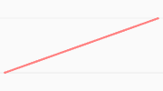

# 视窗(Viewer)

视窗是承载应用的基本部件。创建一个Viewer实例即创建一个场景窗口。

## 构造器

**Viewer(containerId)**

| Name        | Type              | Description                       |
| :---------- | :---------------- | :-------------------------------- |
| `container` | Element \| String | 将容纳Viewer的HTML DOM 元素或ID。 |

## 示例代码

::: code-tabs#Viewer

@tab html

```html
<div id="containerId"></div>
```
@tab ts

```ts
const viewer = new WebGis.Viewer(containerId)
```

:::

## 属性

### axesShow: <font color="gray">boolean</font>

是否显示坐标轴。

### axesLength:<font color="gray">number</font>

坐标轴长度，默认为10。

###  container : <font color=gray>Element</font>

获取父容器。

### entities:[ EntityGroup](../entity/EntityGroup.md)

获取未关联到特定数据源的实体集合

### groundColor:[ Color](../math/Color.md)

获取或设置地面的颜色。

### scene: [Scene](./Scene.md)

`readonly`

获取场景Scene。

## 方法

### drillPick(windowPosition)

| Name           | Type                          | Description    |
| -------------- | ----------------------------- | -------------- |
| windowPosition | [Vector2](../math/Vector2.md) | 鼠标屏幕坐标。 |

从相机位置到windowPosition做一条射线，检测射线与场景的相交部分。返回结果时，相交部分将按距离进行排序，最近的位于第一个）。

该方法返回一个包含有交叉部分的图元数组。

### flyTo(primitive,option)

| Name      | Type                                   | Description        |
| --------- | -------------------------------------- | ------------------ |
| primitive | [Primitive](../primitive/Primitive.md) | 要飞到的目标图元。 |

option具有以下属性：

| Name        | Type                                   | Description                      |
| ----------- | -------------------------------------- | -------------------------------- |
| startTarget | [Primitive](../primitive/Primitive.md) | `optional`开始飞行的指向的图元。 |
| during      | number                                 | `optional`飞行时间。             |
| mode        | string                                 | `optional`飞行模式。             |

相机模式有以下选项：

<div style="display:block;overflow:hidden">
<div style="float:left">
    <p>Linear.None</p>
    
</div> 
<div style="float:left">
    <p>Linear.None</p>
    
</div> 
<div style="float:left">
    <p>Linear.None</p>
    
</div> 
<div style="float:left">
    <p>Linear.None</p>
    
 </div>
</div>

<div style="display:block">相机以缓动动画的形式飞行到指定的图元处。</div>

### getPrimitiveByName(name): [Object3D](../basic/Object3D.md)

| Name | Type   | Description          |
| ---- | ------ | -------------------- |
| name | string | 要获取的图元的名称。 |

根据图元的名称获取图元。若未找到则返回`undefined`。

请注意，大多数的图元中name默认是一个空字符串，要使用这个方法，你将需要手动地设置name属性。

### highLight(primitives)

| Name       | Type                                                | Description        |
| ---------- | --------------------------------------------------- | ------------------ |
| primitives | [&lt;Array&gt;Primitive](../primitive/Primitive.md) | 要高亮的图元数组。 |

高亮场景中的图元。

### pick(windowPosition ,object,recursive): [Primitive](../primitive/Primitive.md)

| Name           | Type                              | Description                                                  |
| -------------- | --------------------------------- | ------------------------------------------------------------ |
| windowPosition | [Vector2](../math/Vector2.md)     | 屏幕坐标。                                                   |
| object         | [Object3D](../basic/Object3D.md)  | 检测与射线相交的物体。                                       |
| recursive      | <font color="gray">boolean</font> | `optional`若为true，则同时也会检查所有的后代。<br />否则将只会检查对象本身。默认值为true。 |

从相机位置到windowPosition做一条射线，检测是否与图元相交。

检测所有在射线与物体之间，包括或不包括后代的相交部分。返回相交图元距离最近的第一个图元。

### pickPosition(windowPosition): [ Vector3](../math/Vector3.md)|<font color="gray">null</font>

| Name             | Type                          | Description |
| :--------------- | :---------------------------- | :---------- |
| `windowPosition` | [Vector2](../math/Vector2.md) | 屏幕坐标。  |

从相机到屏幕坐标做一条射线，拾取场景中物体上的点。

返回相交点的世界坐标；若没有交点返回`null`。

### setSkyBox(source,show)

| Name   | Type                                                         | Description                                                  |
| ------ | ------------------------------------------------------------ | ------------------------------------------------------------ |
| source | {<br />  &nbsp; px:string<br /> &nbsp; mx:string<br /> &nbsp; py:string<br />  &nbsp; my:string<br />  &nbsp; pz:string<br /> &nbsp;  mz:string<br />} | 天空盒纹理贴图，<br />传入前后、左右、上下六个面的纹理图片路径。 |
| show   | boolean                                                      | 是否显示天空盒。                                             |

设置天空盒。未定义时，默认使用星辰效果。

