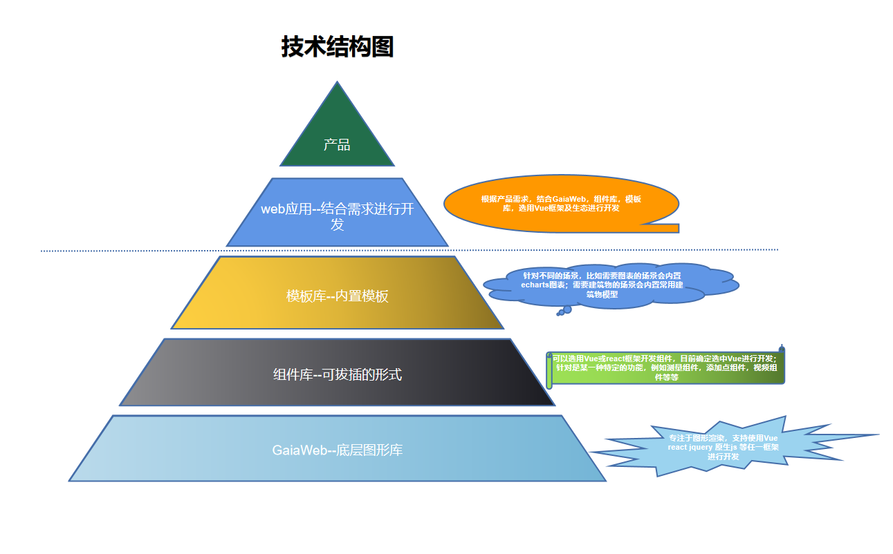

# 介绍

基于three.js封装的3D引擎，适用于gis场景。能实现画多边形，墙，多段线，点，文字，广告牌等图形，具有拾取图元，获取图元，图元高亮，图元显示隐藏，相机飞行，流体墙，场景编辑等交互功能。

## API结构图

## 技术结构图

## 工程化

**工程环境**

- 打包工具--Rollup
- 包管理工具--pnpm
- 开发语言--typescript
- 单元测试--jest
- 模块化规范--esm
- 代码规范--eslint
- 代码格式化--pretty
- 代码提交规范-- commitlint husky commitizen
- 版本管理--git
- 代码压缩--rollup-plugin-terser

## 坐标系

采用的右手直角坐标系；Z轴表示高程信息，正方向朝上；Y轴正方向指向屏幕外；X轴正方向指向左边。
