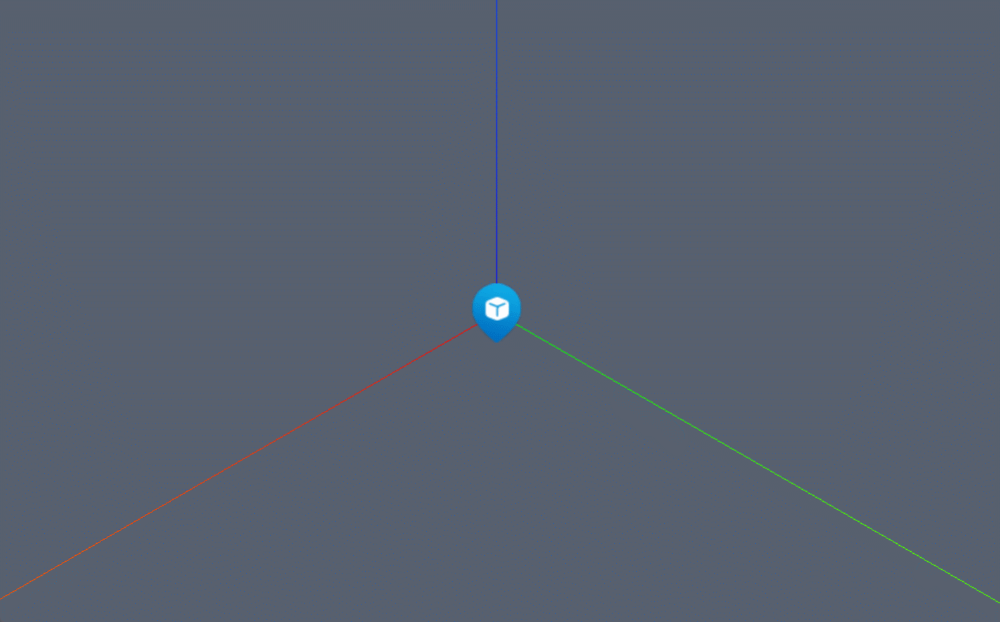

```js
/* 广告牌 */
const billboardGeometry = new Webgis.BillboardGeometry()
// 位置
billboardGeometry.position = new Webgis.Vector3(10, 10, 10);
const billboardMaterial = new Webgis.BillboardMaterial()
// 贴图
billboardMaterial.image = "./assets/icon/1.png"
viewer.scene.primitives.append(new Webgis.Primitive({
  geometryInstances: new Webgis.GeometryInstance({
    geometry: billboardGeometry,
    scale: new Webgis.Vector3(6, 6, 6) 
    /* 广告牌不支持旋转 */
  }),
  appearance: new Webgis.MaterialAppearance({
    material: billboardMaterial,
  }),
  id:"billboard"
}))
```

