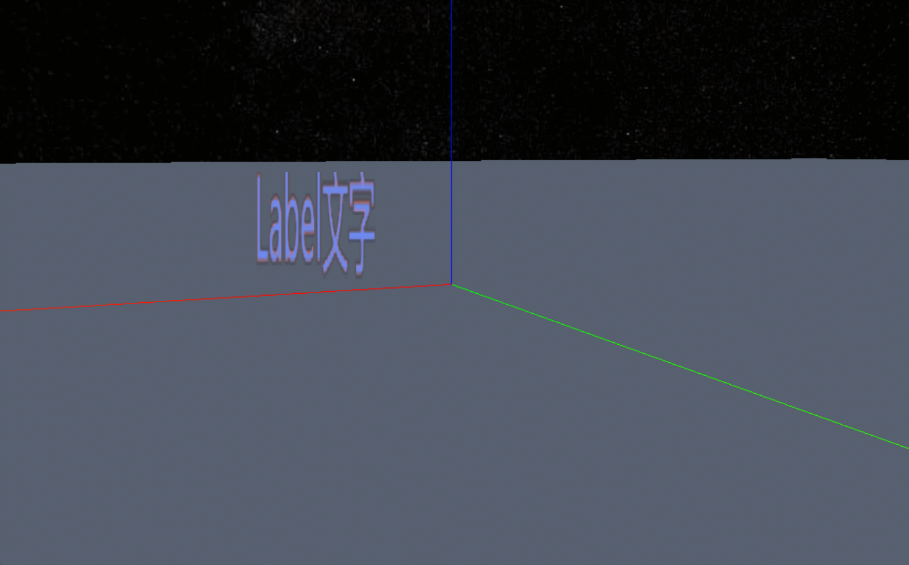

```js
/* 文字 */
const labelGeometry = new Webgis.LabelGeometry();
// 位置
labelGeometry.position = new Webgis.Vector3(10, 10, 10);
const labelMaterial = new Webgis.LabelMaterial();
// 文字内容
labelMaterial.text = "Label文字"
// 粗细 大小 字体
labelMaterial.font = "normal 200px 微软雅黑";
// 颜色
labelMaterial.fillColor = new Webgis.Color(109, 139, 241,1)
// 添加边框
labelMaterial.isOutline = true;
// 边框颜色
labelMaterial.outlineColor = new Webgis.Color(238, 121, 89,1);
// 边框宽度
labelMaterial.outlineWidth = 5;
viewer.scene.primitives.append(
  new Webgis.Primitive({
    geometryInstances: new Webgis.GeometryInstance({
      geometry: labelGeometry,
      // 平移
      translate: new Webgis.Vector3(0, 0, -6),
      // 缩放 注意：缩放要和文字大小配合使用，如果放大很大，而文字大小很小会出现文字模糊现象
      scale: new Webgis.Vector3(5, 5, 5),
      /* 文字不支持旋转 */
    }),
    appearance: new Webgis.MaterialAppearance({
      material: labelMaterial,
    }),
    show: true, // 显示隐藏
    id: "labelId",
    select: false,
  }),
);
```

