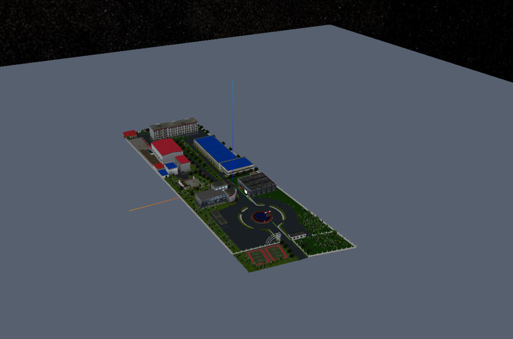

```js
/* 加载模型 */
const modelGeometry = new Webgis.ModelGeometry()
const modelMaterial = new Webgis.ModelMaterial()
modelMaterial.url = './assets/shouan3-2-1png(1).glb'
viewer.scene.primitives.append(
  new Webgis.Primitive({
    geometryInstances: new Webgis.GeometryInstance({
      geometry: modelGeometry,
    }),
    appearance: new Webgis.MaterialAppearance({
      material: modelMaterial,
    }),
    id:"modelId"
  }),
);
```


