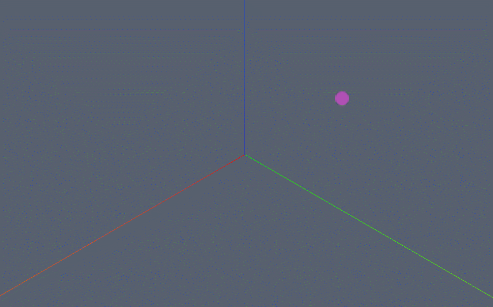

```js
/* 添加点 */
const pointGeometry = new Webgis.PointGeometry()
pointGeometry.position=new Webgis.Vector3(-16, 15, 15);
const pointMaterial = new Webgis.PointMaterial();
pointMaterial.size=5;
pointMaterial.color=new Webgis.Color(187, 79, 189, 1);
pointMaterial.setOpacity(0.9);
viewer.scene.primitives.append(
  new Webgis.Primitive({
    geometryInstances: new Webgis.GeometryInstance({
      geometry: pointGeometry,
      /* 点不支持缩放，旋转 */
    }),
    appearance: new Webgis.MaterialAppearance({
      material: pointMaterial,
    }),
    id:"pointId"
  }),
);
```

