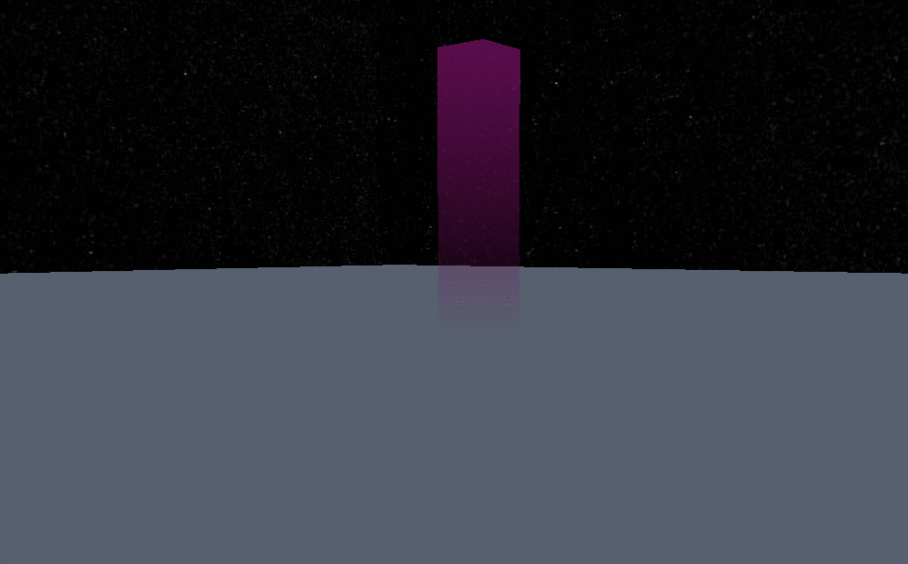

```js
/* 添加区域  */   
const positionArr = [new Webgis.Vector2(5,5), new Webgis.Vector2(-5, 5), new Webgis.Vector2(-5, -5), new Webgis.Vector2(5, -5)];
const polygonGeometry = new Webgis.PolygonGeometry(positionArr);
// 设置拉伸高度  
polygonGeometry.stretch(50);
const polygonMaterial = new Webgis.PolygonMaterial(new Webgis.Color(117, 16, 99,0.5),50); 
viewer.scene.primitives.append(
  new Webgis.Primitive({
    geometryInstances: new Webgis.GeometryInstance({
      geometry: polygonGeometry,
    }),
    appearance: new Webgis.MaterialAppearance({
      material: polygonMaterial,
    }),
    id:"polygonId"
  }),
);
```


