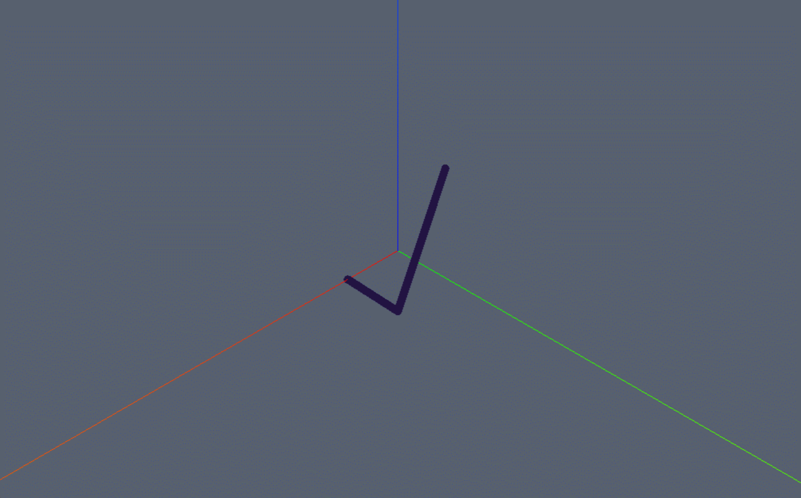

```js
/* 添加线 */
const polylineGeometry = new Webgis.PolylineGeometry();
// 设置路径点
const polyline = [new Webgis.Vector3(-10, 0, 10),new Webgis.Vector3(10, 10, 0),new Webgis.Vector3(10, 0, 0)  ];
polylineGeometry.setPath(polyline);
const polylineMaterial = new Webgis.PolylineMaterial([147, 172, 130]);
// 设置线宽  
polylineMaterial.lineWidth = 10
// 设置颜色
// 设置线类型（实线/虚线）
viewer.scene.primitives.append(
  new Webgis.Primitive({
    geometryInstances: new Webgis.GeometryInstance({
      geometry: polylineGeometry,
    }),
    appearance: new Webgis.MaterialAppearance({
      material: polylineMaterial,
    }),
  }),
);
```


