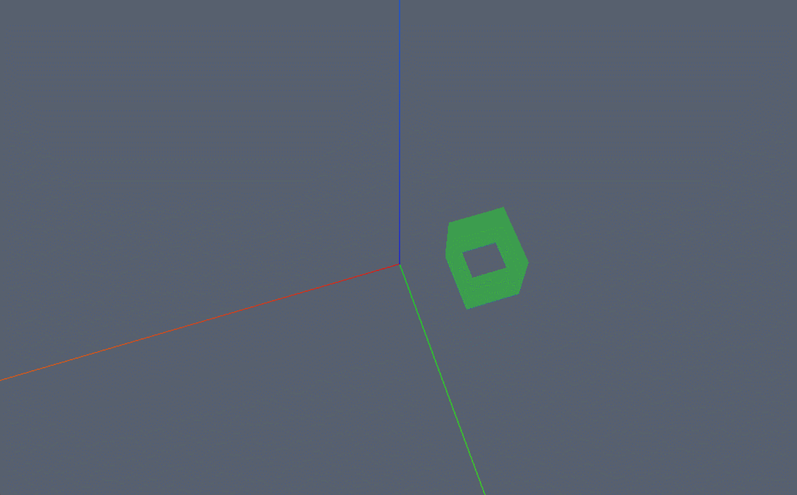
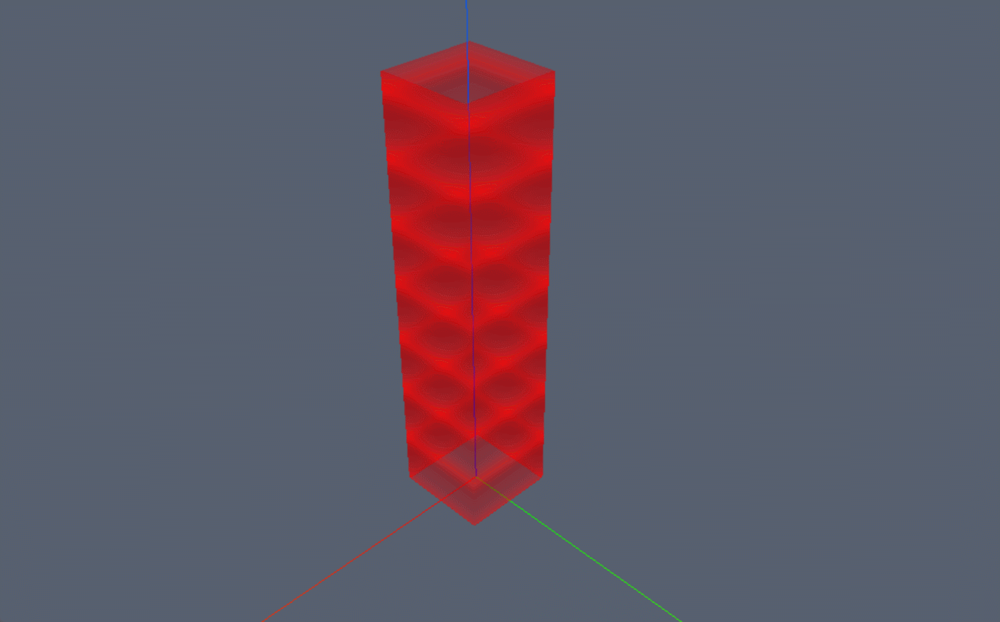

## 添加墙

```js
/* 添加墙 */
const wallPosition = [new Webgis.Vector2(-7, 1), new Webgis.Vector2(-15, 1), new Webgis.Vector2(-15, 10), new Webgis.Vector2(-7, 10)];
const wallGeometry = new Webgis.WallGeometry(wallPosition);
wallGeometry.stretch(10)
const wallMaterial = new Webgis.WallMaterial(new Webgis.Color(60, 158, 78,1));
viewer.scene.primitives.append(
  new Webgis.Primitive({
    geometryInstances: new Webgis.GeometryInstance({
      geometry: wallGeometry,
    }),
    appearance: new Webgis.MaterialAppearance({
      material: wallMaterial,
    }),
    id:"wallId"
  }),
);
```



## 流体墙

```js
/* 流体墙 */
const wallPositionFluid = [new Webgis.Vector2(5.5,5.5), new Webgis.Vector2(-5.5, 5.5), new Webgis.Vector2(-5.5, -5.5), new Webgis.Vector2(5.5, -5.5)]
const wallGeometryFluid = new Webgis.WallGeometry(wallPositionFluid);
wallGeometryFluid.stretch(50)
const wallMaterialFluid = new Webgis.WallMaterial(new Webgis.Color(60, 158, 78,0.6));
wallMaterialFluid.isFluid = true;
viewer.scene.primitives.append(
  new Webgis.Primitive({
    geometryInstances: new Webgis.GeometryInstance({
      geometry: wallGeometryFluid,
    }),
    appearance: new Webgis.MaterialAppearance({
      material: wallMaterialFluid,
    }),
    id:"wallFluidId"
  }),
);
```


