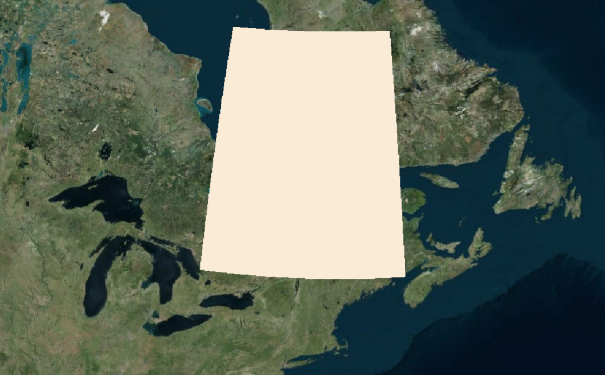

```js
const viewer = new Webgis.Viewer("cesiumContainer", { infoBox: false });

const entities = viewer.entities;
entities.add({
  rectangle: {
    show: true,
    // height: 0,
    coordinates: Webgis.Rectangle.fromDegrees(-92.0, 20.0, -66.0, 57.0), //  从经纬度创建矩形
    material: Webgis.Color.ANTIQUEWHITE,
    outline: true, // 是否有轮廓线
    outLineColor: Webgis.Color.AQUA,
    outLineWidth: 400,
    stRotation: Webgis.Math.toRadians(0), // 旋转角度
    ......
  },
});
```


