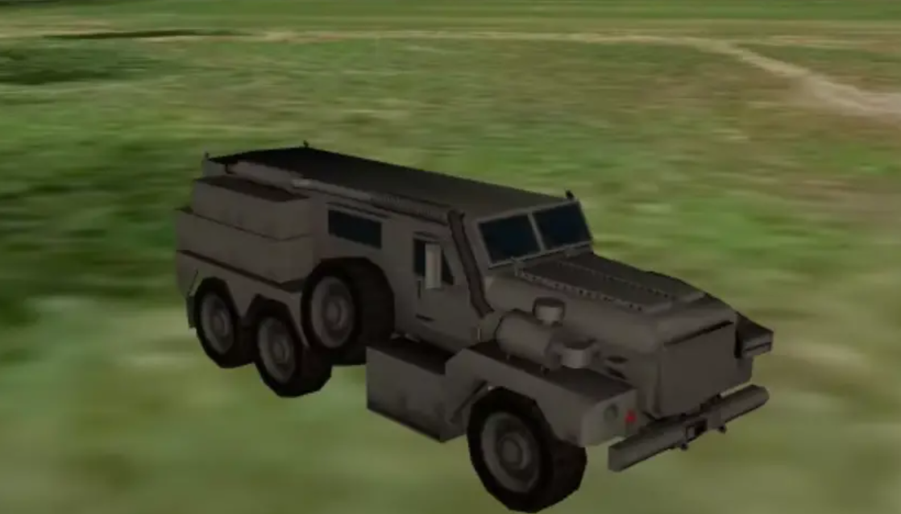

**加载模型**

```js
const viewer = new Webgis.Viewer('WebgisContainer');
var entity = viewer.entities.add({
    position : Webgis.Vector3.(-123.0744619, 44.0503706,66.1321456),
    model : {
        uri : '../../../../Apps/SampleData/models/GroundVehicle/GroundVehicle.glb'
    }
});
viewer.trackedEntity = entity; // 追踪
```



