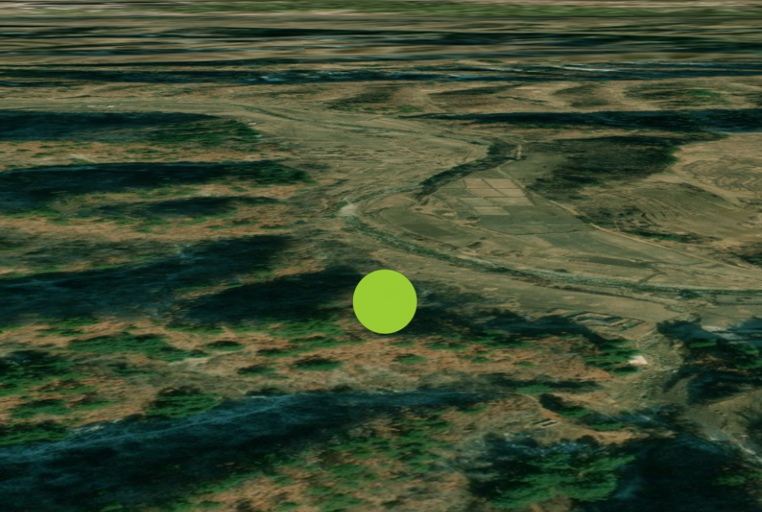

```js
addEntityPoint() {
    let entityPoint = new Webgis.Entity({
        id: 'entityPoint0',
        name: 'entityPoint',
        position: WebgisWebgis.Cartesian3.fromDegrees(125.2, 40.5),
        point: {
            color: Webgis.Color.YELLOWGREEN,
            pixelSize: 40,
            scaleByDistance: new Webgis.NearFarScalar(1.5e2, 2.0, 1.5e7, 0.1),
            translucencyByDistance: new Webgis.NearFarScalar(
                1.5e2,
                1.0,
                1.5e8,
                0.0
            )
        }
    })
    let pointGeom = window.viewer.entities.add(entityPoint)
    window.viewer.zoomTo(pointGeom)
}
```

