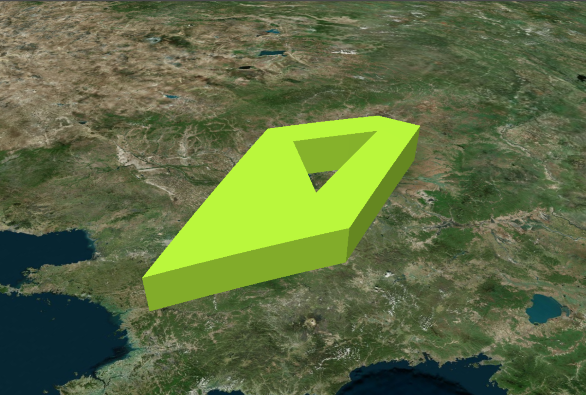

```js
/**
* 添加 entity-polygon
* 面实体, 可以在面中挖空
* **/
addEntityPolygon() {
    let entityPolygon = new Cesium.Entity({
        id: 'entityPolygon0',
        name: 'entityPolygon',
        polygon: {
            hierarchy: {
                positions: Cesium.Cartesian3.fromDegreesArray([
                    125.0, 47.0, 126.3, 47.3, 127.5, 43.6, 124.8, 40.3, 123.0, 45.0
                ]),
                holes: [
                    {
                        positions: Cesium.Cartesian3.fromDegreesArray([
                            125.0, 46.0, 125.5, 46.5, 126.0, 44.0, 124.0, 45.0
                        ])
                    }
                ]
            },
            material: Cesium.Color.YELLOWGREEN,
            extrudedHeight: 100000
            // closeTop: false,
            // closeBottom: false,
        }
    })
    let polygonGeom = window.viewer.entities.add(entityPolygon)
    window.viewer.zoomTo(entityPolygon)
},
```

