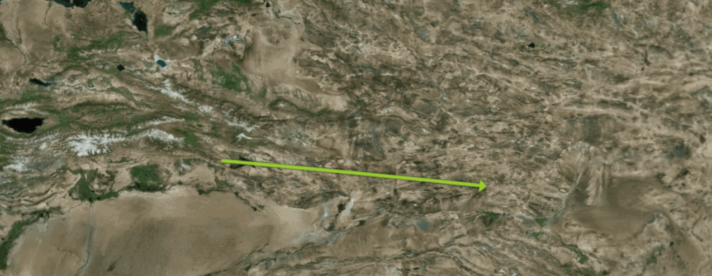

```js
/**
* 添加 entity-polyline
* 线实体， 可以绘制箭头线
* **/
addEntityPolyline() {
    let lontitude = 0
    let latitude = 0
    let nNum = 1
    let isConstant = false
    let entityPolyline = new Webgis.Entity({
        id: 'entityPolyline0',
        name: 'entityPolyline',
        polyline: {
            positions: new Webgis.CallbackProperty(function (time, result) {
                nNum += 0.4
                lontitude = 86 + (nNum - 1) * 0.0333333333
                latitude = 42 + (nNum - 1) * -0.0021212121
                if (lontitude < 119) {
                    return Webgis.Cartesian3.fromDegreesArray([
                        86.0,
                        42.0,
                        lontitude,
                        latitude
                    ])
                } else {
                    return Webgis.Cartesian3.fromDegreesArray([
                        86.0, 42.0, 119.0, 39.9
                    ])
                }
            }, isConstant),
            material: new Webgis.PolylineArrowMaterialProperty(
                Cesium.Color.YELLOWGREEN
            ),
            followSurface: true,
            width: 20
        }
    })
    let polygonGeom = window.viewer.entities.add(entityPolyline)
    window.viewer.zoomTo(entityPolyline)
},
```

