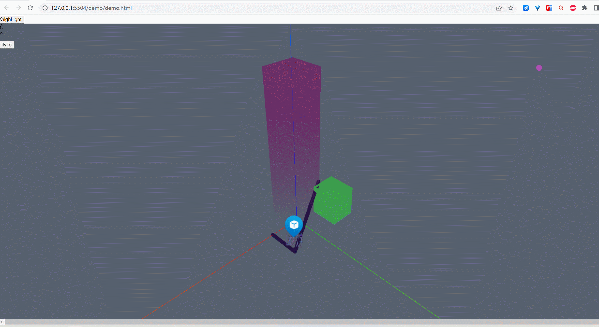

```js
/* 图元高亮 */
const highLightButton = document.getElementById("highLight");
let highFlag = true;
highLightButton.addEventListener("click", () => {
    viewer.highLight([ polygonPrimitive]);
})
```


