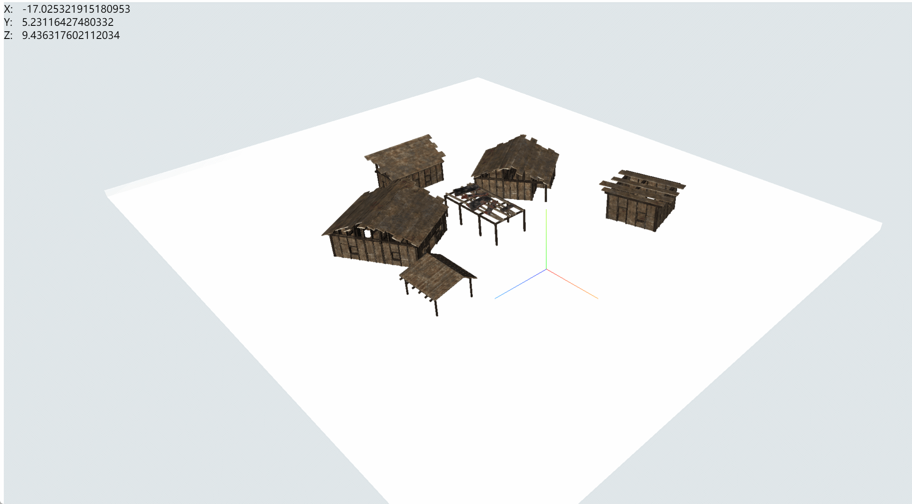

**拾取模型点**

```js
/* 拾取点 */
document.addEventListener('click', (e) => {
  const position = new Webgis.Vector2();
  position.x = e.clientX;
  position.y = e.clientY;

  if (model.isModelReady) {
    const point = viewer.pickPosition(position);

    document.getElementById('x').innerHTML = point.x;
    document.getElementById('y').innerHTML = point.y;
    document.getElementById('z').innerHTML = point.z;
  }
});
```


